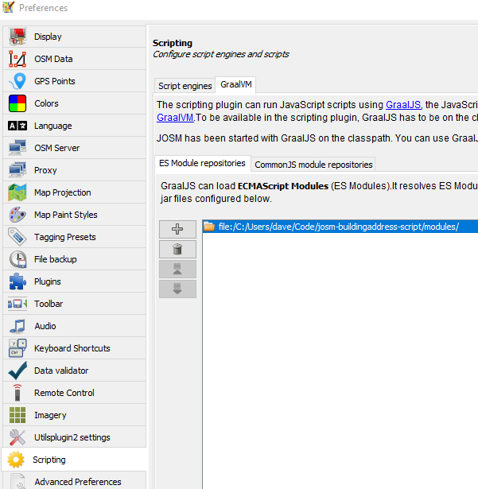

# Apply Building Addres Scripts
A script for the JOSM Scripting Plugin that synthesizes building and parcel data to create buildings with addressess.

The script is written in javascript.  At the moment it uses `console.println` so it has to be run in the scripting console.

## Prerequisites
- [JOSM](https://josm.openstreetmap.de/)
- [JOSM Scripting Plugin](https://gubaer.github.io/josm-scripting-plugin/)
- [Microsoft Building Outlines Data](https://www.microsoft.com/en-us/maps/bing-maps/building-footprints)
- Parcel Data

## Setup

### JOSM Scripting Plugin
Use the GraalVM engine.

Add this repository's `modules` directory as a path:



### Building Footprints
I use [mapshaper](https://mapshaper.org/) to extract a reasonably-sized chunk of data to load into JOSM.  Here's the command I used:

```
mapshaper .\Wisconsin.geojson -clip remove-slivers bbox="-88.07194,43.19139,-87.77883,43.5691" -o ozaukee.geojson
```

The geojson file can then be directly opened in JOSM.

### Parcel Data
I downloaded parcels for my county from [my state's GIS site](https://maps.sco.wisc.edu/Parcels/).  They offered a Shapefile download but in the EPSG:3071 spatial reference so I used mapshaper to convert:

```
mapshaper .\V900_Wisconsin_Parcels_OZAUKEE_SHP.zip -proj wgs84 -o format=geojson countyparcels.geojson
```

If your jurisdiction runs ArcGIS there should be a REST endpoint to serve the same purpose; here's an example to get parcels within a bounding box:

```
POST https://gis2.co.ozaukee.wi.us/arcgis/rest/services/OZCadastral/MapServer/25/query

Body is form/multipart with these key/value pairs:

geometry    {xmin: -88.024, ymin: 43.259, xmax: -88.000, ymax: 43.273}
inSR        4326
outSR       4326
f           geojson
outFields   *
```

>:warning: It's likely that the data property names from your source will not exactly match what I have in my script!

## Workflows

The script is `apply-building-address.js`.

I use this script in two ways:
- To set address information for buildings already saved in the OSM database
- To both import the building outline and add address information to it

In both cases it will print out the addresses it was able to find.  If there were any problems those will be listed under each address.

### Existing Buildings
This assumes that you're working in a layer downloaded directly from OSM.

Select your buildings and run the script.  Review your work and then just hit the upload button.

### New Buildings
This assumes that you now have an additional layer opened from your parcel `.geojson` file.  

Select your buildings and run the script.  Review your work and then use the "upload selected" File option, or `Ctrl+Shift+Alt+U` on your keyboard; your selection will be preserved.  If you do lose your selection, no big deal!  Do a search for `modified AND building:`.

The sript removes the `release` and `capture_date_range` tags from the outline objects.

If you get a warning about uploads being stronly discouraged from this layer, then:
1. Save the layer to a `.osm` file
2. Edit the file, removing the `upload` attribute in the `osm` element:
    ```xml
    <?xml version='1.0' encoding='UTF-8'?>
    <osm version='0.6' generator='JOSM' upload='false'>
    </osm>
    ```
