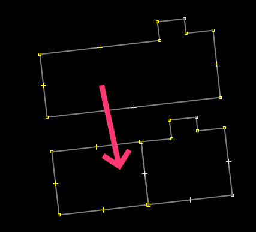

# My Scripts
This is a collection of utility scripts for the [JOSM Scripting Plugin](https://gubaer.github.io/josm-scripting-plugin/).

## Apply Building Address

Using parcel data in another layer this script will fetch and apply the correct address to a selected building(s).

[See More](apply-building-address.md)

## Building Bisector

This script is able to bisect a closed way (building) into two halves along the long axis.  It handles irregularly-shaped buildings which the terrace plugin has trouble with.

[Script](bisect.js)

## Duplicate Way Finders
- select-duplicate-ways-by-node.js
- select-duplicate-ways.js